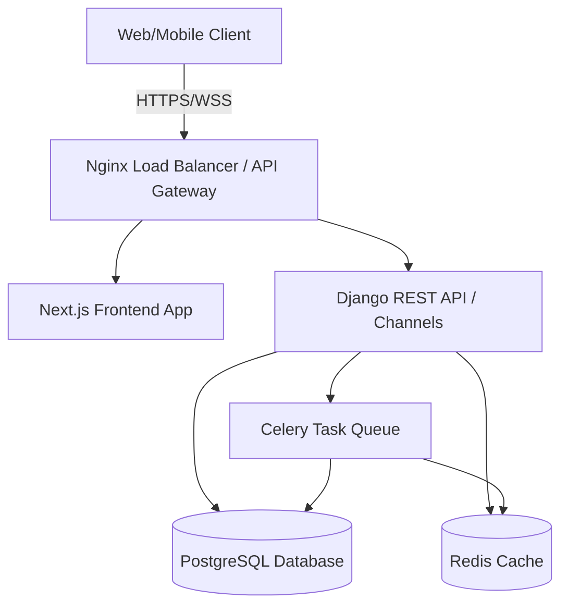
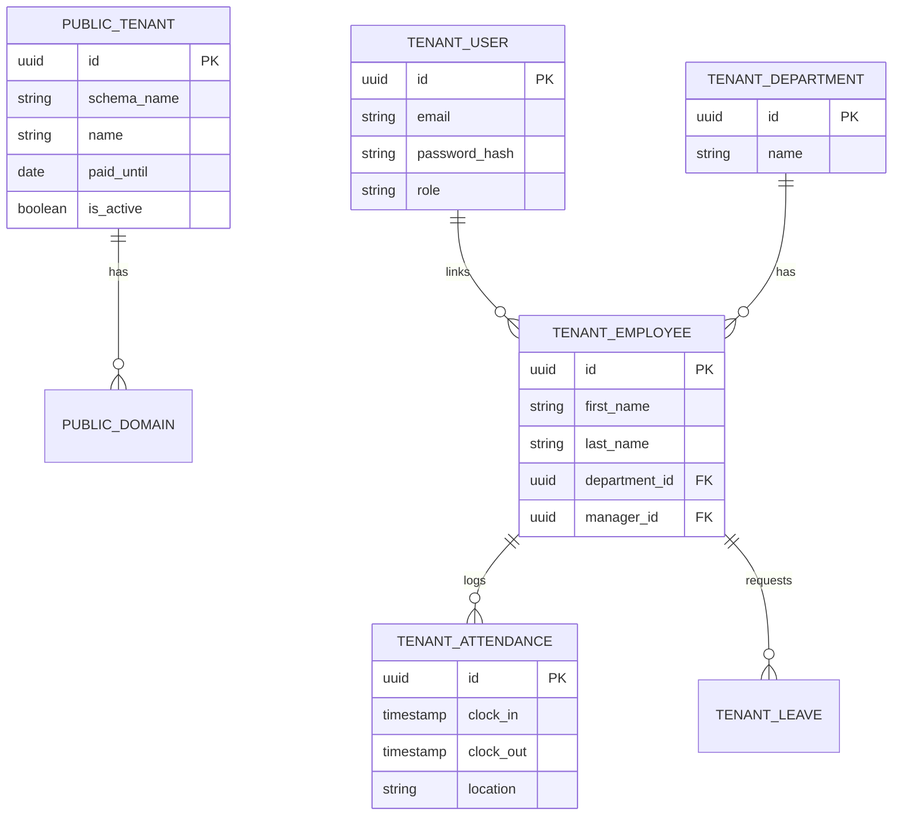

# Enterprise Multi-Tenant HRMS Project Roadmap & Architecture Plan

This document outlines the initial planning phases (1-5) for the Enterprise Multi-Tenant HRMS, as requested.

## User Review Required

Please review the proposed architecture, requirements, and database design. Once approved, we will proceed to generate the backend and frontend folder structures (Phases 6 & 7) and begin the implementation phase.

> [!IMPORTANT]
> This plan proposes **Schema-based Multi-Tenancy** (using PostgreSQL schemas, e.g., via `django-tenants`) to guarantee strict data isolation between companies. Please confirm if you prefer this over **Row-level Multi-Tenancy** (using a `tenant_id` foreign key on every table). Schema-based is more secure and scalable for enterprise SaaS.

## Phase 1: High-Level Architecture

* **Frontend:** Next.js (App Router), React, TypeScript, TailwindCSS, Shadcn UI, Zustand for state management, TanStack Query for data fetching, Framer Motion for animations.
* **Backend:** Python, Django, Django REST Framework (DRF), Celery (for background tasks), Channels/WebSockets (for real-time features).
* **Database:** PostgreSQL (primary relational data store), Redis (caching and message broker for Celery/Channels).
* **Infrastructure:** Docker containerization, prepared for Kubernetes (Helm charts), Nginx as reverse proxy.

## Phase 2: Functional Requirements

* **Super Admin Portal:** Tenant (Company) creation/suspension, global billing, subscription plans, global settings, analytics, system logs.
* **Tenant Administration:** Employee management, departments, locations, organizational charts, roles and permissions.
* **Time & Attendance:** Clock In/Out, biometric/GPS integration readiness, geofencing, IP restrictions, shift management, timesheets.
* **Leave Management:** Leave types, accrual policies, approval workflows, comp-offs, leave calendar.
* **Payroll & Finance:** Salary structures, automated payroll processing, tax calculations, payslips, expense claims, reimbursements.
* **Talent Management:** Recruitment (ATS), onboarding workflows, performance appraisals, OKRs, goals, 1:1 meetings.
* **Core HR Operations:** Asset management, document storage (offer letters, NDAs), helpdesk ticketing, announcements, exit management.

## Phase 3: Non-Functional Requirements

* **Security:** JWT authentication (access/refresh token rotation), robust RBAC, tenant data isolation, CSRF/XSS protection, rate limiting, audit logs.
* **Performance:** Redis caching, optimized database queries (`select_related`, `prefetch_related`), pagination, background jobs for heavy tasks.
* **Scalability:** Stateless API design, horizontally scalable web and worker nodes.
* **UI/UX Aesthetics:** World-class Apple/Linear-inspired minimal design, glassmorphism, soft shadows, dark/light mode, smooth micro-animations.

## Phase 4: System Design

* **Clean Architecture & DDD:** Separation of concerns using Service Layer, Repository Pattern, and Domain-Driven Design (grouping by domains: Identity, CoreHR, Payroll, etc.).
* **Authentication Flow:** 
  1. User authenticates via email/password or SSO.
  2. Receives short-lived JWT Access Token and secure HTTP-only Refresh Token.
  3. Tenant is resolved via subdomain (e.g., `companyA.hrms.com`) or custom header.
* **Multi-Tenant Context:** Middleware intercepts requests, resolves tenant, and sets the active PostgreSQL search path (schema) to isolate data queries automatically.

## Phase 5: Database Design (High-Level ERD)

*Note: In the schema-based isolation strategy, `PUBLIC_TENANT` resides in the `public` schema. Tables prefixed with `TENANT_` represent models that are dynamically replicated and isolated within each company's specific schema.*

## Next Steps in Generation Strategy

Upon approval of this architectural plan, we will move to the next phases:
1. **Phase 6:** Backend Folder Structure (Enterprise Clean Architecture)
2. **Phase 7:** Frontend Folder Structure (Feature-Based Next.js App Router)
3. **Phase 8:** Authentication & Authorization implementation
4. **Phase 9:** Multi-Tenant Architecture setup
5. **Phase 10:** Shared Components & Design System creation
